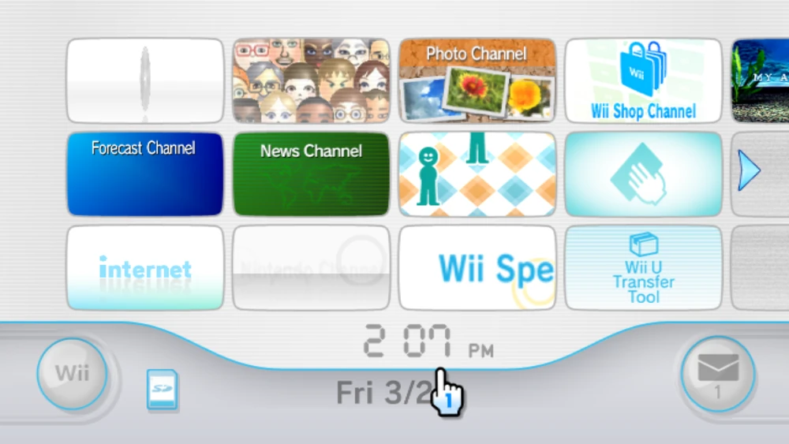

# Personal Portfolio Website

Welcome to my personal website!

## Live Demo

[Check out my live website here!](https://www.beratbulbul.com/)

---

## Technologies I Use

Here are some of the technologies and tools this project uses:

-   **Languages:** TypeScript, HTML, CSS
-   **Frameworks:** React, TailwindCSS, Next.JS
-   **Technologies:** Vercel Hosting, Git

---

## My Vision

-   I've based my design entirely on the original Wii menu, as it just gives me so much nostalgia.
-   My inspiration:
    
